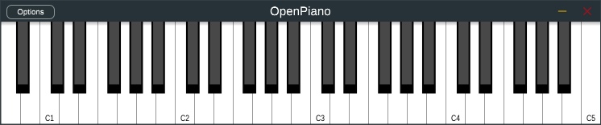
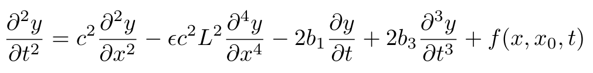

# Open Piano: an open source piano engine based on physical modeling



## Summary
### [1. What is Open Piano?](#what-is-open-piano)
### [2. How do I use it?](#how-do-i-use-it)
### [3. Building](#building)
### [4. Current state and road map](#current-state-and-road-map)
### [5. How does it work?](#how-does-it-work)
### [6. Can I contribute to this project?](#can-i-contribute-to-this-project)
### [7. Are you crazy?](#are-you-crazy)


## What is Open Piano?
Open Piano is an attempt at recreating the characteristic sound of the piano with physical modeling sound synthesis. This allows for greater expressiveness and flexibility in comparison to sampled pianos. There is also no need to download huge libraries of audio samples, since everything is generated in real time.

## How do I use it?
**DISCLAIMER:** I don't discourage you from trying out Open Piano, but please note that this is still alpha quality software. As of now, it is nowhere near commercial plugins like Modartt's [Pianoteq](https://www.modartt.com/pianoteq) (which I own, and love) or Arturia's [Piano V](https://www.arturia.com/products/analog-classics/piano-v/overview). 

A first binary release of Open Piano will be published once the project reaches a usable state.

## Building
To build the Open Piano JUCE app/plugin, you will need CMake (version 3.15 or above), a C++ compiler (C++17 or above), and the latest version of the [JUCE](https://github.com/juce-framework/JUCE) library. Once you clone/download this repository, you need to clone/download a copy of JUCE inside the `OpenPianoJUCE/` folder. You end up with this directory structure:

```
OpenPiano
├── OpenPianoCore/
├   ├── Source/
├   └── CMakeLists.txt
└── OpenPianoJUCE/
    ├── JUCE/
    ├── Source/
    └── CMakeLists.txt
```
* Windows/macOS/Linux: if you use a CMake-based IDE like CLion or QtCreator, use it to open `CMakeLists.txt` and proceed building from there.
* Windows only: download and install the latest [CMake installer](https://cmake.org/download/), [Visual Studio Community](https://visualstudio.microsoft.com/vs/community/) IDE, and the [Windows SDK](https://developer.microsoft.com/en-us/windows/downloads/windows-sdk/). Open CMake, point it to the source folder (OpenPianoJUCE or OpenPianoCore), and generate a VS project to be opened in Visual Studio.
* macOS only: download and install XCode from the App Store and the [CMake installer](https://cmake.org/download/). Use CMake to generate an XCode project.
* Linux/macOS and other UNIX/UNIX-based/UNIX-like operating systems: use the command line :wink:

## Current state and road map
Right now, Open Piano sounds like a strangely out of tune piano with no soundboard and only one string per note. Here's a short list of what needs to be done:
* [x] ~~Fix repeated hits of the string by the hammer, without resetting the entire string displacement (see [here](https://github.com/michele-perrone/OpenPiano/blob/c338f46ce50802265661e2898c5619e9c2654629/OpenPianoCore/string_hammer.h#L307))~~ - Fixed [HERE](https://github.com/michele-perrone/OpenPiano/commit/d0461f860075b43f8b4d246c1d99371dc0ab606f) 
* [x] ~~Optimize the FD model to make it... usable~~ - Partially done [HERE](https://github.com/michele-perrone/OpenPiano/commit/eb89378566dbc875619000024de95a31c819be7c), but there's room for improvement
* [x] ~~Take advantage of multithreading~~ - Semi-decent implementation [HERE](https://github.com/michele-perrone/OpenPiano/commit/c8868d6180c09d2e3bc9c06715db37fbe9c68205)
* [x] ~~Add string dampers (normal people call it pedal)~~ - Rudimentary implementation [HERE](https://github.com/michele-perrone/OpenPiano/commit/79f3d8d2aae4c2b4e68de793d5fe940273fde638)
* [ ] Find a mitigation for the fact that higher strings have a decreasingly lower spatial resolution, which makes it impossible to use the entire piano range with reasonable sampling frequencies
* [ ] Simulate multiple strings per note and the double decay phenomenon
* [ ] Simulate the soundboard
* [ ] Find a decent set of physical parameters for all the strings
* [ ] Simulate sympathetic resonances
* [ ] (In case FD shows itself to be too burdensome, consider the possibility of switching to modal analysis)

## How does it work?
Everything starts from the differential equation of vibration of a lossy stiff string, hit by a hammer:



To obtain the spatial displacement of each piano string at each temporal instant, we need to solve this equation. There are different approaches: two examples are finite differences (FD) and modal analysis. The idea behind FD is to discretize the differential equation by substituting its derivatives with finite differences - hence the name. Modal analysis, on the other hand, assumes that the solutions of the equation are in modal form, and discretizes the solutions rather than the equation itself. Open Piano uses the FD approach.

## Can I contribute to this project?
Once the project reaches a certain usability level, contributions will be welcome.

## Are you crazy?
Yes I do. I am. Whatever
